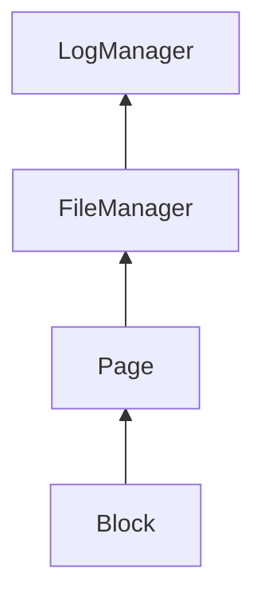

by Edward Sciore

My personal note during reading this book.

# Chapter 3: Disk and File Management
- Abstracts 2 OS interfaces: block-level and file-level

> Platter capacities of over 40 GB are now common

This book was published in 2008 that HDD of this size was uncommon 

>access time for 1000 bytes is essentially the same as for 1 byte. In other words, it makes no sense to access a few bytes from disk

Still relevant even for modern day SSD

>The real value of a disk cache is its ability to pre-fetch sectors. Instead of reading
just a requested sector, the disk drive can read the entire track containing that sector
into the cache, in the hope that other sectors of the track will be requested later

Even modern OS's also do the same. So, multiple level of pre-fetching, will it be redundant or make read even more faster?  #to-read 

>The set of tracks having the same track number is called a cylinder, because if you
look at those tracks from the top of the disk, they describe the outside of a cylinder.

it's nice to know the origin of a given term

>The term disk striping comes from the following imagery: If you imagine that each small disk is painted in a different color, then the virtual disk looks like it has stripes, with its sectors painted in alternating colors
 
also this 

## The Block-Level Interface to the Disk

Sectors -> block  XXX - Cannot directly access it
Sectors -> memory page -> block

> To modify the contents of a block, a client must read the block into a page, modify the bytes in the page, and then write the page back to the block on disk

That's why we want to maximize each operation

Tracking available block
1. Disk Map
	Basically bit map
	{0, 0, 0, 0, 1 , 1, 1, 1}
	0 = block is free
	1 = occupied
	
2. Free List
	Not going to go to the technical details, but i just hate this kind data structure  
	
	The idea that, to allocate some N blocks, you have to keep traversing until you find enough space... 
	![[free-list.png]]
	It is space efficient, but the user pays somewhere the cost somewhere else. 
	To me, diskmap seems to be an easier and more convenient choice (for the programmer...  )

## The File-Level Interface to the Disk

File abstraction 
> a client can read (or write) any number of bytes starting at any position in the file.

>The Java class RandomAccessFile provides a typical API to the le system. Each RandomAccessFile object holds a file pointer that indicates the byte at which the next read or write operation will occur.
>This file pointer can be set explicitly by a call to `seek`. A call to the method readInt (or writeInt) will also move the le pointer past the integer it read (or wrote).

IMO, `RandomAccessFile` is a bad/expensive abstraction i.e.  It gives you the idea that you can read/write byte at a time, when actually it will perform single syscall.

Ideally, wrap it in a buffer that will pull one page at a time.

```rust
use std::fs::File;
use std::io::BufReader;
use byteorder::{BigEndian, ReadBytesExt};

fn main() -> std::io::Result<()> {
    let file = File::open("data.bin")?;
    // Wraps file in an 8KB RAM buffer
    let mut reader = BufReader::new(file);
    // This first call pulls a full 8KB page into RAM from disk
    let first = reader.read_i32::<BigEndian>()?;
    // Subsequent reads hit the RAM buffer instantly—zero syscalls!
    let second = reader.read_i32::<BigEndian>()?;

    Ok(())
}
```

For write, there's also a write buffer, but I think we'll take that into account on buffer management chapter.

> Note that the calls to readInt and writeInt act as if the disk were being
accessed directly, hiding the fact that disk blocks must be accessed through pages.
An OS typically reserves several pages of memory for its own use; these pages are
called I/O buffers. When a file is opened, the OS assigns an I/O buffer to the file,
unbeknownst to the client.

Oh nice, the book also calling it out 

File `seek`'s task

1. convert byte to logical block ref (eg: byte pos 6000, is on block 1, i.e., 6000// mod 4k block size, is 1). This is easy
2. Covert logical block (eg: 1) into an actual physical reference (hard)

3 methods of file allocation
1. Continous allocation
	 - simplest
	 - suffer from internal fragmentation, (i.e. can only work with contiguous location. Cannot be extended once it's created, so it allocates large segment that might not be used) 
	 - and external frags (i.e. because of prev issue, you cannot create bigger file because empty space are scattered anywhere, despite being a lot of them)
 2. Extend based alloc
	 in some sense, this is almost works similarly with free list above?
 3. Indexed allocation
	 this is like a lookup index that give map of block. Neat in the idea, but that means a single file can be scattered across blocks? I wonder how OS can optimize this on a spinning disk.
	 ![[indexed-alloc.png]]


## The Database System and the OS
Basically the classic telling us to not rely on OS filesystem, because of less control over block, pages, io buffers, etc  
Not relying on OS filesystem will also makes it super hard, i.e. mounting disk as raw disk that we take control of *physical* block.
Middle ground is to use treat OS files as "raw disk" using logical file block, i.e. it's not an actual block, we still rely on OS to translates these logical blocks into physical block via `seek`. Conventional wisdom accepts this tradeoff.  I may interested in modern-day hardware-accelerated logical-to-physical block translation #to-read

## The SimpleDB File Manager

Coding part, let's goo  

How files in SimpleDB are organized:
1. One table one file
2. One index one file
3. One WAL file for all (?)
4. Several catalog file (i.e. table metadata)

3 classes, 
- BlockId, 
- Page, 
- and FileMgr

How to convert them into Rust? eg: do I need separate abstraction or I can do 1-1 mapping? I think so, at least for this part. 


#### Page
> Its first constructor creates a page that gets its memory from an operating system I/O buffer; this constructor is used by the buffer manager. Its second constructor creates a page that gets its memory from a Java array

I wonder if i should implement  `from` trait ? It's only 2, probably just normal `fn` is enough

   (ai answer): from is from type A to type B conversion. Using simple method is correct.


>A page can hold three value types: ints, strings, and“blobs” (i.e., arbitrary arrays of bytes).

I'm thinking whether or not I should push these kind of convenience methods down to lowest level (eg: page level) or I should just keep as minimal interface as possible (i.e. just accepts `&[u8]` instead of `&str` )?

>A client can store a value at any offset of the page but is responsible for knowing what values have been stored where. An attempt to get a value from the wrong offset will have unpredictable results.

I hate this part the most... handwritten byte serde is the worst. Let me search for library for doing this part...

#### FileManager

>The read method reads the contents of the specified block into the specifed
page. The write method performs the inverse operation, writing the contents of a
page to the specified block

This was quite unnatural to me first time reading and coding it, and it still is.
Probably because earlier discussion on trying to model logical block ops via filesystem.

>Note how the file manager always reads or writes a block-sized number of bytes from a file and always at a block boundary. In doing so, the file manager ensures that each call to read, write, or append will incur exactly one disk access.

Basically page access.

```java
public synchronized BlockId append(String filename) {
	int newblknum = size(filename);
	BlockId blk = new BlockId(filename, newblknum);
	byte[] b = new byte[blocksize];
	try {
	RandomAccessFile f = getFile(blk.fileName());
	f.seek(blk.number() * blocksize);
	f.write(b);
}
```

I hate doing this in Rust. There's a need for syncronization point. I want to avoid it, but then, because of block is calculated on-the-fly i.e. not persisted anywhere, I cannot leverage lockless structure like skipmap that i already have.  

Ok I spent more time than I thought would be
I learned how to write generics to access my page's internal buffer

```rust
pub struct Page {
    // buffer structure
    // | data len | value
    // | i16 (2B) | varlen
    pub(crate) buffer: Vec<u8>,
}

pub(crate) trait Readable<'a, 'b>: Sized {
    fn read(page: &'b Page, offset: usize) -> Self
    where
        'b: 'a;
}

pub(crate) trait Writable: Sized {
    fn write(self, page: &mut Page, offset: usize);
}

impl<'a, 'b> Readable<'a, 'b> for i32 {
    fn read(page: &'b Page, offset: usize) -> Self {
        BigEndian::read_i32(&page.buffer[offset as usize..])
    }
}

impl Writable for i32 {
    fn write(self, page: &mut Page, offset: usize) {
        BigEndian::write_i32(&mut page.buffer[offset..], self);
    }
}

// and few more types
```

Also, I made a shortcut by using lockless `crossbeam_skiplist::SkipMap` library for make my life easier 

```rust
pub struct FileManager {
    ...
    files: Arc<SkipMap<String, Arc<FileHandle>>>,
}

```


The rest are in this [commit](https://github.com/luqmansen/asdf/commit/46a687bb7e9d13fa14b8136855a7b8907c65c587#diff-42cb6807ad74b3e201c5a7ca98b911c5fa08380e942be6e4ac5807f8377f87fcR12-R15) 

I skipped over few things, like adding `ASCII encoding` length, because i think directly using `&[u8]` is more idiomatic for rust. For java,  maybe it's important because string -> bytes conversion is very dependent on the encoding used.

Also, there's probably bunch of edge cases optimization, especially in the file flushing mechanism. Book took the easy path by always flushing to disk for every write. Not wrong but might not necessary for every write (i.e. it's ok to cache some writes in OS cache). The only place where it matters is probably on WAL

Eg: I want to try `FileExt::write_vectored_at` to write multiple buffer on single syscall (well it's 2 but anyway)


# Chapter 4: Memory Management

 Log manager
 - only sequential access
 -  simple, optimal memory-management algorithm
Buffer Mgr
- arbitrary access user files

## Principle of Memory Management in DBs
1. Minimize Disk Access
	Write as much as possible to page (ram) and flush to disk in batch
	
2. Don’t Rely on OS's Virtual Memory 
	 Q: I know that I can implement buffer management to control disk access, but how do I know if it actually works? i.e. my db page isn't unnecessarily swapped/paged out by OS when it's still in use. Where is the line between trusting OS cache (Not MMAP) or disk cache (hardware cache)
	Test harness that test crash recovery ability is one way, but I want more deterministic confirmation
	
	 : Few things 
		1. O_DIRECT for bypass OS page cache. Unfortunately doesn't exists in Mac. This will require ultimate granular write control, because frankly, not all writes need to be directly to disk. Only things like WAL that requires it, otherwise, Regular write/update can just write to OS cache safely. 
		2. O_DIRECT bypasses the page cache, but the OS virtual memory manager (VMM) can still swap out your user-space buffer pool memory (anonymous memory)
		How to verify
		 - No Major page faults during buffer access. This utility shoudl be available in stdlib (`getrusage()`) https://docs.rs/libc/latest/libc/fn.getrusage.html this usage should not increase after accessing buffered page.
		- Inspect /proc/{pid}/smaps
		- eBPF
			Trace whether I/O requests originate from my code thread system calls (eg: pwritev2) rather than kernel page-fault routines (do_anonymous_page or filemap_fault)

## Log Manager
Q: Diving more through this chapter, now I realize that this book really fixated on the diea that disk write must be aligned 1 page at a time, even for this log manager, which essentially append only. Quite contrast with [[LSM in 3 weeks]] which it has no regard of page, granted that 1 flush of SST is typically 64 - 128MB. 

Also talking about append only structure. I was thinking that it is still considered slow write if we're talking about spinning splatter. Because the wal flush might interleave with other operation (read / write) in other sector, so the mechanical head isn't stay still on the same location where WAL is.

  : this is way on spinning disk, typically WAL is written to separate disk drive/volume.

Clever!

>As far as the log manager is concerned, a log record is an arbitrarily sized byte array;  it saves the array in the log file but has no idea what its contents denote

I forgot this part, but I believe upstream will decide what's written here. Quite modular per se. So up until this point, the abstraction is 



>The return value from append identifies the new log record; this identifier is called its log sequence number (or LSN).

Just want to highlight LSN will be an important point down the line, esp during transaction &/ recovery.

>Appending a record to the log does not guarantee that the record will get written
to disk; instead, the log manager chooses when to write log records to disk

Oh, so technically we can write larger page / batching more than one pages together 

--

I'm done with Log Manager. I hate to admit but i'm fucking dumb on this. It took much time just to debug my implementation of log iterator. 

Also, I should've learn about leveraging rust's type system that makes "invalid state unrepresentable"

For example, tracking the iterator state using hand-rolled cursor implementation is pain in the butt. 

```rust

// Cursor::At(98)              Cursor::Exhausted
// ┌────────┬────────┐         ┌────────┬────────┐
// │ tag  0 │   98   │         │ tag  1 │ unused │
// └────────┴────────┘         └────────┴────────┘
//   8 bytes  8 bytes            16 bytes total

enum Cursor {
    At(usize),
    Exhausted,
}
```

This won't completely eliminate your bug, can make it slightly less painful. However, this will only be as good as how good you model your invariants. This require a lot of exercise and frankly I don't have that much experience. However, I do know that you can make it even more painful if you modeled it improperly though...  


## Buffer Manager
This is also hard. Let's try how much we can push the state modeling here.

> Page pinning.

On the read side, it has some resemblances with how `RWLock` works. I still have unresolved questions of how far we can use OS locking primitives for database locking (oh wait, maybe this is for transaction chapter.)

```
Buffer Pool
- Page
  ----
	- status 
	- buffer
	  
```

>there are only two reasons why a buffer will ever need to write a modified page to disk
>1. Needs to be replaced to other block
>2. Force flush by recovery manager

**Buffer replacement strategies**

>Given the set of unpinned pages, the buffer manager needs to decide which of
those pages will not be needed for the longest amount of time

Strategies
- Naive
	- Seq. traversal, choose whatever first found
	- very bad. Don't even think of it
- FIFO
	- choose oldest buffer
	- bad when, eg: catalog pages would've been the oldest but we want to keep them there. 
- LRU
	- choose last accessed buffer
	- effective for general-purpose buffer
- Clock
	- This is like a circular ring with a cursor that bookmark latest location of the latest replacement.
		Quote: "The idea is that if a page is frequently used, there is a high probability that it will be pinned when its turn for replacement arrives. If so, then it is skipped over and given “another chance.”


**Implementation Notes**
There're lots of micro optimization can be done, especially on this lock structuring

 Now, buffer miss will force serialize the read and let everyone  waits for slow 2x io lookup (flush + read)  consider to make these non blocking for other reader and
 make only lock the final "swap".
 
 Also, apparently I cannot just copy the design from the `mini-lsm` as is around the state read-write management. Mainly because buffer manager is not immutable as in LSM-tree, i.e. the code around pin-unpin are heavy R-W-U.
 
 At this point, I feel like if you want to push more micro optimization by having more and more granular locksssss 

Let me save the session here for my future refactor [[SimpleDB Buffer Manager]]


**Quizzesssss**

>The code for LogMgr.iterator calls flush. Is this call necessary?Explain.

 Since write is buffered to ram, creating a log needs to read whatever we have after creation.
 
 We can not flush but it will require reading from page (in-mem) then switch to reading the file. Micro optimization 


>4.3. Can more than one buffer ever be assigned to the same block? Explain.

No, it should be one the the invariant.

Otherwise, 2 writes might ended up overwriting each other if flushing is interleaved.


>4.4. The buffer replacement strategies in this chapter do not distinguish between
modified and unmodified pages when looking for an available buffer. A
possible improvement is for the buffer manager to always replace an
unmodified page whenever possible.
(a) Give one reason why this suggestion could reduce the number of disk
accesses made by the buffer manager.
(b) Give one reason why this suggestion could increase the number of disk
accesses made by the buffer manager.
(c) Do you think strategy is worthwhile? Explain.


Answer:

This is apparently a nuance question.
Let's answer from C: the answer is "it depends". We need to measure the workload 

It depends on the workload.
A -> evicts clean page 
For write heavy workload to the same dirty page, if we keep dirty page, we'll avoid evict it now and prevent near future load in other slot

B -> evict dirty page
For hot clean page that will be read repeatedly, dirty page is less useful here


#revisit-later
>Another possible buffer replacement strategy is least recently modified: the
buffer manager chooses the modified buffer having the lowest LSN. Explain
why such a strategy might be worthwhile.

In a way, this is almost similar with LRU, except we track the LSN instead of just purely access time. I mean it always make sense? least LSN means that page hasn't been updated for a while. Especially for write heavy workload. 
For read heavy, i don't think this matter, or even harmful


> 4.6. Suppose that a buffer page has been modified several times without being
written to disk. The buffer saves only the LSN of the most recent change and
sends only this LSN to the log manager when the page is finally flushed.
Explain why the buffer doesn’t need to send the other LSNs to the log
manager.


>4.7. Consider the example pin/unpin scenario of Fig. 4.9a, together with the
additional operations pin(60); pin(70). For each of the four replacement
strategies given in the text, draw the state of the buffers, assuming that the
buffer pool contains five buffers.

>4.8. Starting from the buffer state of Fig. 4.9b, give a scenario in which:
(a) The FIFO strategy requires the fewest disk accesses
(b) The LRU strategy requires the fewest disk accesses
(c) The clock strategy requires the fewest disk accesses

>4.9. Suppose that two different clients each want to pin the same block but are
placed on the wait list because no buffers are available. Consider the imple-
mentation of the SimpleDB class BufferMgr. Show that when a single
buffer becomes available, both clients will be able to use it.


The programming exercise is also really interesting. Let's revisit that later once we're completed the whole DB #revisit-later


# Chapter 5: TRANSAXTIONSSSS

**5.3 Recovery manageemnt**
1. write log rec
2. rollback
3. recover

**5.3.1 Log Rec** 
- start
- comit
- rollback
- update
	- string
	- int
This is basically write ahead log. 
Each log needs its own type(we'll use rust enum tag)
interestingly, the update needs to be specific. I thought i could simply add extra subtag for an arbitrary update operation

```rust

enum {
	start{id},
	
	commit{id},
	
	rollback{id},
		
	update{id, filename, blocknum, offset, prev_value, new_value }
}
```

**5.3.2 Rollback** 

recall that we write log record backward, it's because we doing rollback, we basically undo each operation from the most recent one, 1-1 (see `update` log record above, it contains prev and new value for given row)


**REDO**

2 stages
stage-1
undo log -> reads backward, undo uncommited logs

stage 2 
redo log -> redo commited transactions that hasn't been written to disk yet. reads forward. It gathers the list of commited tx from stage 1 ... 2 birds 1 stone  

actually, redo doesn't care about what states of the disk, that is, it may have written to disk, but redo algorithm will overwrite whatever there, because log is the source of truth.

**5.3.4 Undo-Only and Redo-Only Recovery**

