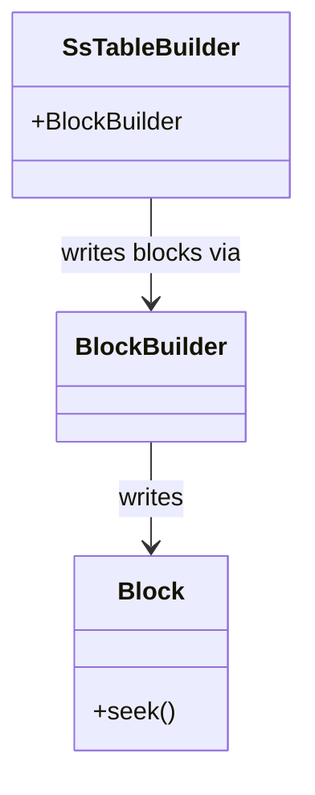

I learned tons of stuff as rust beginner here, from a simple concept such as idiomatic unwrap, up until esoteric use of rust specifically when you're writing storage system, eg: how to NOT sprinkling around `Arc<Mutex<T>>` and use proper data sharing method, like self-referential struct, GAT, HRTB, etc.

Here is just random note I jot down during my learning. 

### Observations
- Because the way the course is designed with rigorous enough test, i didn't really put extra attention towards the edge-cases of my code
- also, it has easily become "just do whatever i need to make the test pass" and didn't really look around the code, because of that
- Sometimes I wasn't aware about the full structure of each component. For example, during SST section, i wasn't aware that `block_meta_offset` was part of the struct property and I had to needlessly read at the end of the file
	```rust
	    let start_offset = self.block_meta.get(block_idx).unwrap().offset;
        let end_offset = {
            match self.block_meta.get(block_idx + 1) {
                Some(m) => m.offset as u32,
                None => {
                    // // last item, then read start of metadata section
                    // let mut buff = vec![0u8; 4];
                    // self.file
                    //     .0
                    //     .as_ref()
                    //     .unwrap()
                    //     .read_exact_at(&mut buff, self.file.1 - 4)?;

                    // u32::from_be_bytes(buff.try_into().unwrap())
                    //
                    
                    // correct version
                    self.block_meta_offset as u32
                }
            }
        };****
	```
	i definitely felt the smell coz my initial solution definitely a double disk seek. Thankfully it was being caught when I ask AI why the code feels dumb lol.
### Uncategorized

- *Idiomatic unwrap*

It was really hard for me to understand, why would people NOT do this
```rust
if variable.is_none() {
	do_negative(varible.unwrap()); // basically double check :D
}

do_positive();
```

Because coming from Golang, or other higher level languages, I always thinking that this is the most natural way of doing thing. You figure out the negative space first, and check all condition 1-by-1.

The intuition would be: 
- walrus operator (python) / go -style
- use `let Some` when you care about the other arm. If you care about both cases, then you are supposed to use `match`.
	```rust
	// bad
	if result.is_some(){
		let data = result.unwrap(); // double unwrap basically, 2 instruction
		return data
	}

	match state.memtable.get(key) {
	    Some(value) => {
	        return Ok(Some(value).filter(|v| !v.is_empty()));
	    }
	    None => {} // "Do nothing, just pass through"
	}
	
	if let Some(value) = state.memtable.get(key) {
	    return Ok(Some(value).filter(|v| !v.is_empty()));
	}
	```


- On edge-cases
	this course setup makes me not thinking about edge-cases at all, because it gives me re-assurance that all edgecases are handled so that i can just focus on the main event. This question just struck me on w1d3 question asking what happen at the end of block ends and key  not found.

- `unwrap()` => `assert!()` 
  I know unwrap everywhere basically is just lazy execuse. BUT i for development, it's a huge debugging helper. When I expect something to never fail but then it fail, i will get that error bubbled up early. Also later down the line, it's easier for me to assert the assumption on any part of the code.

### Storage Design Abstraction

high level schema how each component is connected. Somewhat low level to get me easy overview of how things are connected



## Test your understanding

This is from end section of each chapter. I'm rushing to finish this tutorial. 
Not writing down all of my answers and just to get past this. Will revisit and writing down when reviewing 

### Week 1 day 1 - Memtable

> Why do we need a combination of `state` and `state_lock`? Can we only use `state.read()` and `state.write()`?

Because the state.read is supposed to be used for interior mutability, meaning that it is only to mutate the internals of the state. The state lock on the other hand, needs to be used to mutate the current state. So if you want to change the instance of the current state with the other state, you cannot just use the state RW log. You need to lock the whole LSM storage.

> 💡 correction
>This is mainly for performance concern. Because when flushing happens (which can be slow), reader still can read the database.


### Week 1 day 2 - Merge Iterator

https://skyzh.github.io/mini-lsm/week1-02-merge-iterator.html#test-your-understanding)

> What is the time/space complexity of using your merge iterator?

Space -> we're using reference everywhere, i think it's almost 0 allocation. So space is 1
Time -> for each Next():
		sorting the heap 
			the sorting itself sould be N log N
			 but the pop action itself potentially be N times  the memtable -> but memtable amount is bounded, so at most it's constant. But we havent talk about SST -> but again, this is later will be compacted, so at most there will be M level 
			 
*correction


> Why do we need a self-referential structure for memtable iterator?

Because our iterator buffer uses skipmap AND the cursor is an actual internal memory pointer to that skimap.
For convenient, we want to store both together for easy API access
Unfortunately, rust by default won't allow this because struct may be reallocated somewhere and the cursor pointer might moved, ended up pointing to a dangling pointer.

So we're using this crate  to pin the struct location to memory.

technically speaking, if we can somehow using a type of cursor that can be serialized, (eg: cursor for an array can be a simple index),
we might not need this self-referential structure (like our block iterator, which use a plain offset start/end as the cursor iterator.)


#to-answer-later 
Q: If a key is removed (there is a delete tombstone), do you need to return it to the user? Where did you handle this logic?


Q: If a key has multiple versions, will the user see all of them? Where did you handle this logic?

Q: If we want to get rid of self-referential structure and have a lifetime on the memtable iterator (i.e., `MemtableIterator<'a>`, where `'a` = memtable or `LsmStorageInner` lifetime), is it still possible to implement the `scan` functionality?

Q: What happens if (1) we create an iterator on the skiplist memtable (2) someone inserts new keys into the memtable (3) will the iterator see the new key?

Q: What happens if your key comparator cannot give the binary heap implementation a stable order?
- Why do we need to ensure the merge iterator returns data in the iterator construction order?
- Is it possible to implement a Rust-style iterator (i.e., `next(&self) -> (Key, Value)`) for LSM iterators? What are the pros/cons?
- The scan interface is like `fn scan(&self, lower: Bound<&[u8]>, upper: Bound<&[u8]>)`. How to make this API compatible with Rust-style range (i.e., `key_a..key_b`)? If you implement this, try to pass a full range `..` to the interface and see what will happen.
- The starter code provides the merge iterator interface to store `Box<I>` instead of `I`. What might be the reason behind that?

## [Week 1 day 3 - Block](https://skyzh.github.io/mini-lsm/week1-03-block.html#test-your-understanding)

> What is the time complexity of seeking a key in the block?

Should be O(N). Data is sorted, so we just perform linear search.

> Where does the cursor stop when you seek a non-existent key in your implementation?

Within block, it should be at the end of `block.data`  
I'm using `bytes::Buf` so the cursor will advance automatically until the very end

```rust
        while data.has_remaining() {
            // -----------------------------------------------------------------------
            // | key_len (2B) | key (keylen) | value_len (2B) | value (varlen) | ... |
            // -----------------------------------------------------------------------

            let key_len = data.get_u16();
            key_bytes = data.copy_to_bytes(key_len as usize);
            value_len = data.get_u16();
            data.advance(value_len as usize);

            let current_keyslice = KeySlice::from_slice(key_bytes.as_ref());
            current_pos = initial_len - data.remaining();

            if current_keyslice >= key {
                break;
            }
        }
```
 (i think i haven't handled the end-of block / key not found case 😂)

> So `Block` is simply a vector of raw data and a vector of offsets. Can we change them to `Byte` and `Arc<[u16]>`, and change all the iterator interfaces to return `Byte` instead of `&[u8]`? (Assume that we use `Byte::slice` to return a slice of the block without copying.) What are the pros/cons?

Yes (unfortunately i have asked this prior this test to LLM 😢)

It's just a type wrapper / compile time check for pure dev experience. At runtime it's completely opaque to program. 

> What is the endian of the numbers written into the blocks in your implementation?

To be fair i don't know really specify it. But It's happen that 
```rust
let key_len = data.get_u16();
```
will  read in big-endian order

so does my encoding
```rust
   pub fn encode(&self) -> Bytes {
        let mut b = BytesMut::new();

        b.put_slice(self.data.as_ref());
        for &u in &self.offsets {
            b.put_u16(u);
        }

        // note to self: usize is 8 bytes, u16 is 2 bytes.
        let cnt = self.offsets.len();
        b.put_u16(cnt as u16);

        b.freeze()
    }
```


> Is your implementation prune to a maliciously-built block? Will there be invalid memory access, or OOMs, if a user deliberately construct an invalid block?

haven't checked it. Likely 😂

I will just this chance to learn about fuzzer on my next toy database project.

> Can a block contain duplicated keys?

I think so. `Block` abstraction is technically opaque to key abstraction. Though the second duplicate key won't ever get read because explicitly during seek anyway.


>What happens if the user adds a key larger than the target block size?

entire block is occupied to that 1 key 

>Consider the case that the LSM engine is built on object store services (S3). How would you optimize/change the block format and parameters to make it suitable for such services?

I should minize disk read write 
So maybe batch larger write/read

(will think more through. I'm interested to implement this as well)


# Week 1 Day 4 - SSTable 

[[2026-07-05]]

Q: reading this part, initially I wasn't really understand why SSTable has to accept individual key. I thought SSTable supposedly to just wrap memtable
```rust
impl SsTableBuilder {
	pub fn add(&mut self, key: KeySlice, value: &[u8]) {
```
 A: Aight, huge misunderstanding. Memtable is a skiplist,  in-memory formatted. SST is a binary encoded format. There's no direct translation. You gotta encode key by key manually

***

There're tons of indirection methods in all of the iterator classes.

A typical pattern

```rust

struct HigherLevelIterator {
	inner_iter: LowerLevelIterator,
}


impl StorageIterator for HigherLevelIterator {
	fn key() {
		self.inner_iter.key()
	}
	fn value() {
		self.inner_iter.value()
	}
	fn is_valid() {
		self.inner_iter.is_valid()
	}
	
	fn next() {
		// this is usually where the meat of this iterator
	}
}
```

This happens, for example in `SSTableIterator` -> `BlockIterator`, or `LSMIterator` -> `MergeIterator`
Seeing this repetitive pattern sometimes makes me feel lost in this forest of indirection and missing the big picture. 


Also, `next()` convention is kind messing up with me a bit. I feel like the interface could slightly better

why do we play guessing "if null this maybe be that" instead of returning strongly typed Enum, for example
```rust
enum IterNextReturn {
 EndOfIteration
 GenuineRuntimeError
 GenuineIoError
}
```

And the downstream's `next()` could handle that accordingly, instead of relying on the local state `{inner_iter}.is_valid()`

>💡 Apparently this is already a common pattern in other storage engine like rocksdb, where end of iteration basically just return nothing. Error will be preserved when it's a genuine error, like IO error or Network error, etc.

> Also why `next()` doesn't return the actual value instead of advancing the cursor is because the `key()` or `value()` might be called multiple time within the same iteration. Eg; for sorting in the merge iterator, internally the heap may call `key()`  multiple times during comparsion. 


## [Test Your Understanding](https://skyzh.github.io/mini-lsm/week1-04-sst.html#test-your-understanding)
[[2026-07-08]]

Q: What is the time complexity of seeking a key in the SST?
A: it's a binary search, should be O(log N)

Q: Where does the cursor stop when you seek a non-existent key in your implementation?
A:   If the key is in between the block, but none of the block contains it (eg: my keys are 1,2,3,4.....8,9,10,11). If i'm looking for 5,6 it won't exists. Current implementation will stop at next block, i.e the `8,9,10` block
if the key is greater than any key existed in the given sst, it will stop at the last block, aka just end of the block. Block::seek_to_key will seek until the end and upstream will just receive invalid iterator 


Q: Is it possible (or necessary) to do in-place updates of SST files?
A: Possible? ofc. Just rewrite the file, easy. Necessary? obv no. The point of LSM/SST is to have append only system

Q: An SST is usually large (i.e., 256MB). In this case, the cost of copying/expanding the `Vec` would be significant. Does your 
implementation allocate enough space for your SST builder in advance? How did you implement it?
A: Good one. My implementation is just empty `vec![]` without pre-allocation. I have no good answer at the moment. I'm thinking default unix allocator should be good enough, but im probably wrong. #to-answer-later


Q: Looking at the `moka` block cache, why does it return `Arc<Error>` instead of the original `Error`?
A: (just a gist from reading the `try_get_with` docstring) Because moka guarantee that the lambda/closure function passed to it will be evaluated only once/coalesced into one evaluation during concurrent execution, that means the Err will also only produced by 1 function and it will be cloned to all the caller.


Q: Does the usage of a block cache guarantee that there will be at most a fixed number of blocks in memory? For example, if you have a `moka` block cache of 4GB and block size of 4KB, will there be more than 4GB/4KB number of blocks in memory at the same time?
A: To my understanding, yes. Since blockcache is a singleton shared across N SSTs, it should also automatically evict block when it's full


Q: Is it possible to store columnar data (i.e., a table of 100 integer columns) in an LSM engine? Is the current SST format still a good choice?
A: Should be yes if we replace the block encoding format to be more columnar friendly


Q: Consider the case that the LSM engine is built on object store services (i.e., S3). How would you optimize/change the SST format/parameters and the block cache to make it suitable for such services?
A: #to-answer-later 

Q: For now, we load the index of all SSTs into the memory. Assume you have a 16GB memory reserved for the indexes, can you estimate 
the maximum size of the database your LSM system can support? (That’s why you need an index cache!)
A: #to-answer-later 


## Week 1 Day 5 - Read Path
[[2026-07-11]]


```rust
type LsmIteratorInner = 
	TwoMergeIterator<MergeIterator<MemTableIterator>, MergeIterator<SsTableIterator>>;
```

When I see something like this, I got scared sometimes. Mind you that this is just a shorthand to make things look neat and clean.

```rust
use std::ops::Bound;

fn foo(start_bound: Bound<T>)
```

Bound type basically just represent one end point, inclusiec, exclusive, or unbounded.
eg:
- In range x >= 5 (included)
- out range x >= 5 (excluded)

Okay, i got this, understandable. Question: why? Why does it have to live as std instead of my own code?

Apparently it's just a syntax sugar, that compiles into differnt concrete type

eg:
- `std::ops::Range<i32>` -> {start: 5, end: 10}
- `std::ops::RangeTo<i32>` -> {end: 10}