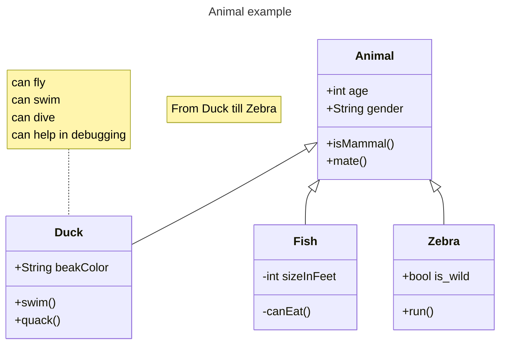

I learned tons of stuff as rust beginner here, from a simple concept such as idiomatic unwrap, up until esoteric use of rust specifically when you're writing storage system, eg: how to NOT sprinkling around `Arc<Mutex<T>>` and use proper data sharing method, like self-referential struct, GAT, HRTB, etc.

Here is just random note I jot down during my learning. 

### Uncategorized

*Idiomatic unwrap*

The intuition would be: 
- walrus operator (python) / go -style
- use `let Some` when you care about the other arm. If you care about both cases, then you are supposed to use `match`.
	```rust
	// bad
	if result.is_some(){
		let data = result.unwrap(); // double unwrap basically, 2 instruction
		return data
	}

	match state.memtable.get(key) {
	    Some(value) => {
	        return Ok(Some(value).filter(|v| !v.is_empty()));
	    }
	    None => {} // "Do nothing, just pass through"
	}
	
	if let Some(value) = state.memtable.get(key) {
	    return Ok(Some(value).filter(|v| !v.is_empty()));
	}
	```


### Storage Design Abstraction

high level schema how each component is connected



## Test your understanding

This is from end section of each chapter. I'm rushing to finish this tutorial. 
Not writing down all of my answers and just to get past this. Will revisit and writing down when reviewing 

### Week 1 day 1 - Memtable

> Why do we need a combination of `state` and `state_lock`? Can we only use `state.read()` and `state.write()`?

Because the state.read is supposed to be used for interior mutability, meaning that it is only to mutate the internals of the state. The state lock on the other hand, needs to be used to mutate the current state. So if you want to change the instance of the current state with the other state, you cannot just use the state RW log. You need to lock the whole LSM storage.

> 💡 correction
>This is mainly for performance concern. Because when flushing happens (which can be slow), reader still can read the database.


### Week 1 day 2 - Merge Iterator

https://skyzh.github.io/mini-lsm/week1-02-merge-iterator.html#test-your-understanding)

> What is the time/space complexity of using your merge iterator?

Space -> we're using reference everywhere, i think it's almost 0 allocation. So space is 1
Time -> for each Next():
		sorting the heap 
			the sorting itself sould be N log N
			 but the pop action itself potentially be N times  the memtable -> but memtable amount is bounded, so at most it's constant. But we havent talk about SST -> but again, this is later will be compacted, so at most there will be M level 
			 
*correction


> Why do we need a self-referential structure for memtable iterator?


> If a key is removed (there is a delete tombstone), do you need to return it to the user? Where did you handle this logic?


- If a key has multiple versions, will the user see all of them? Where did you handle this logic?
- If we want to get rid of self-referential structure and have a lifetime on the memtable iterator (i.e., `MemtableIterator<'a>`, where `'a` = memtable or `LsmStorageInner` lifetime), is it still possible to implement the `scan` functionality?
- What happens if (1) we create an iterator on the skiplist memtable (2) someone inserts new keys into the memtable (3) will the iterator see the new key?
- What happens if your key comparator cannot give the binary heap implementation a stable order?
- Why do we need to ensure the merge iterator returns data in the iterator construction order?
- Is it possible to implement a Rust-style iterator (i.e., `next(&self) -> (Key, Value)`) for LSM iterators? What are the pros/cons?
- The scan interface is like `fn scan(&self, lower: Bound<&[u8]>, upper: Bound<&[u8]>)`. How to make this API compatible with Rust-style range (i.e., `key_a..key_b`)? If you implement this, try to pass a full range `..` to the interface and see what will happen.
- The starter code provides the merge iterator interface to store `Box<I>` instead of `I`. What might be the reason behind that?

## [Week 1 day 3 - Block](https://skyzh.github.io/mini-lsm/week1-03-block.html#test-your-understanding)

> What is the time complexity of seeking a key in the block?

Should be O(N). Data is sorted, so we just perform linear search.

> Where does the cursor stop when you seek a non-existent key in your implementation?

Within block, it should be at the end of `block.data`  
I'm using `bytes::Buf` so the cursor will advance automatically until the very end

```rust
        while data.has_remaining() {
            // -----------------------------------------------------------------------
            // | key_len (2B) | key (keylen) | value_len (2B) | value (varlen) | ... |
            // -----------------------------------------------------------------------

            let key_len = data.get_u16();
            key_bytes = data.copy_to_bytes(key_len as usize);
            value_len = data.get_u16();
            data.advance(value_len as usize);

            let current_keyslice = KeySlice::from_slice(key_bytes.as_ref());
            current_pos = initial_len - data.remaining();

            if current_keyslice >= key {
                break;
            }
        }
```
 (i think i haven't handled the end-of block / key not found case 😂)

> So `Block` is simply a vector of raw data and a vector of offsets. Can we change them to `Byte` and `Arc<[u16]>`, and change all the iterator interfaces to return `Byte` instead of `&[u8]`? (Assume that we use `Byte::slice` to return a slice of the block without copying.) What are the pros/cons?

Yes (unfortunately i have asked this prior this test to LLM 😢)

It's just a type wrapper / compile time check for pure dev experience. At runtime it's completely opaque to program. 

> What is the endian of the numbers written into the blocks in your implementation?

To be fair i don't know really specify it. But It's happen that 
```rust
let key_len = data.get_u16();
```
will  read in big-endian order

so does my encoding
```rust
   pub fn encode(&self) -> Bytes {
        let mut b = BytesMut::new();

        b.put_slice(self.data.as_ref());
        for &u in &self.offsets {
            b.put_u16(u);
        }

        // note to self: usize is 8 bytes, u16 is 2 bytes.
        let cnt = self.offsets.len();
        b.put_u16(cnt as u16);

        b.freeze()
    }
```


> Is your implementation prune to a maliciously-built block? Will there be invalid memory access, or OOMs, if a user deliberately construct an invalid block?

haven't checked it. Likely 😂

I will just this chance to learn about fuzzer on my next toy database project.

> Can a block contain duplicated keys?

I think so. `Block` abstraction is technically opaque to key abstraction. Though the second duplicate key won't ever get read because explicitly during seek anyway.


>What happens if the user adds a key larger than the target block size?

entire block is occupied to that 1 key 

>Consider the case that the LSM engine is built on object store services (S3). How would you optimize/change the block format and parameters to make it suitable for such services?

I should minize disk read write 
So maybe batch larger write/read

(will think more through. I'm interested to implement this as well)