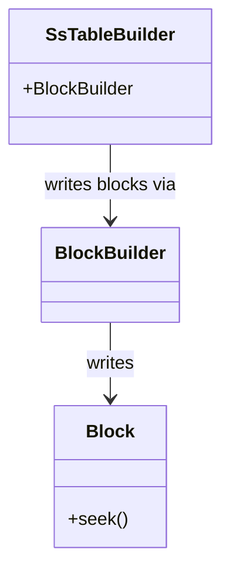

I learned tons of stuff as rust beginner here, from a simple concept such as idiomatic unwrap, up until esoteric use of rust specifically when you're writing storage system, eg: how to NOT sprinkling around `Arc<Mutex<T>>` and use proper data sharing method, like self-referential struct, GAT, HRTB, etc.

Here is just random note I jot down during my learning. 

### Observations
- Because the way the course is designed with rigorous enough test, i didn't really put extra attention towards the edge-cases of my code
- also, it has easily become "just do whatever i need to make the test pass" and didn't really look around the code, because of that
- Sometimes I wasn't aware about the full structure of each component. For example, during SST section, i wasn't aware that `block_meta_offset` was part of the struct property and I had to needlessly read at the end of the file
	```rust
	    let start_offset = self.block_meta.get(block_idx).unwrap().offset;
        let end_offset = {
            match self.block_meta.get(block_idx + 1) {
                Some(m) => m.offset as u32,
                None => {
                    // // last item, then read start of metadata section
                    // let mut buff = vec![0u8; 4];
                    // self.file
                    //     .0
                    //     .as_ref()
                    //     .unwrap()
                    //     .read_exact_at(&mut buff, self.file.1 - 4)?;

                    // u32::from_be_bytes(buff.try_into().unwrap())
                    //
                    
                    // correct version
                    self.block_meta_offset as u32
                }
            }
        };****
	```
	i definitely felt the smell coz my initial solution definitely a double disk seek. Thankfully it was being caught when I ask AI why the code feels dumb lol.

### Uncategorized

- *Idiomatic unwrap*

It was really hard for me to understand, why would people NOT do this
```rust
if variable.is_none() {
	do_negative(varible.unwrap()); // basically double check :D
}

do_positive();
```

Because coming from Golang, or other higher level languages, I always thinking that this is the most natural way of doing thing. You figure out the negative space first, and check all condition 1-by-1.

The intuition would be: 
- walrus operator (python) / go -style
- use `let Some` when you care about the other arm. If you care about both cases, then you are supposed to use `match`.
	```rust
	// bad
	if result.is_some(){
		let data = result.unwrap(); // double unwrap basically, 2 instruction
		return data
	}

	match state.memtable.get(key) {
	    Some(value) => {
	        return Ok(Some(value).filter(|v| !v.is_empty()));
	    }
	    None => {} // "Do nothing, just pass through"
	}
	
	if let Some(value) = state.memtable.get(key) {
	    return Ok(Some(value).filter(|v| !v.is_empty()));
	}
	```


- On edge-cases
	this course setup makes me not thinking about edge-cases at all, because it gives me re-assurance that all edgecases are handled so that i can just focus on the main event. This question just struck me on w1d3 question asking what happen at the end of block ends and key  not found.

- `unwrap()` => `assert!()` 
  I know unwrap everywhere basically is just lazy execuse. BUT i for development, it's a huge debugging helper. When I expect something to never fail but then it fail, i will get that error bubbled up early. Also later down the line, it's easier for me to assert the assumption on any part of the code.

### Storage Design Abstraction

high level schema how each component is connected. Somewhat low level to get me easy overview of how things are connected

```mermaid

classDiagram
    class Block {
        +seek()
    }
    class BlockBuilder {
    }
    class SsTableBuilder {
        +BlockBuilder
    }
    
    SsTableBuilder --> BlockBuilder : writes blocks via
    BlockBuilder --> Block: writes
```


# Test your understanding Sections

This is from end section of each chapter. I'm rushing to finish this tutorial. 
Not writing down all of my answers and just to get past this. Will revisit and writing down when reviewing 

## Week 1 day 1 - Memtable

> Why do we need a combination of `state` and `state_lock`? Can we only use `state.read()` and `state.write()`?

Because the state.read is supposed to be used for interior mutability, meaning that it is only to mutate the internals of the state. The state lock on the other hand, needs to be used to mutate the current state. So if you want to change the instance of the current state with the other state, you cannot just use the state RW log. You need to lock the whole LSM storage.

> 💡 correction
>This is mainly for performance concern. Because when flushing happens (which can be slow), reader still can read the database.


## Week 1 day 2 - Merge Iterator

https://skyzh.github.io/mini-lsm/week1-02-merge-iterator.html#test-your-understanding)

> What is the time/space complexity of using your merge iterator?

Space -> we're using reference everywhere, i think it's almost 0 allocation. So space is 1
Time -> for each Next():
		sorting the heap 
			the sorting itself sould be N log N
			 but the pop action itself potentially be N times  the memtable -> but memtable amount is bounded, so at most it's constant. But we havent talk about SST -> but again, this is later will be compacted, so at most there will be M level 
			 
*correction


> Why do we need a self-referential structure for memtable iterator?

Because our iterator buffer uses skipmap AND the cursor is an actual internal memory pointer to that skimap.
For convenient, we want to store both together for easy API access
Unfortunately, rust by default won't allow this because struct may be reallocated somewhere and the cursor pointer might moved, ended up pointing to a dangling pointer.

So we're using this crate  to pin the struct location to memory.

technically speaking, if we can somehow using a type of cursor that can be serialized, (eg: cursor for an array can be a simple index),
we might not need this self-referential structure (like our block iterator, which use a plain offset start/end as the cursor iterator.)


#to-answer-later 
Q: If a key is removed (there is a delete tombstone), do you need to return it to the user? Where did you handle this logic?


Q: If a key has multiple versions, will the user see all of them? Where did you handle this logic?

Q: If we want to get rid of self-referential structure and have a lifetime on the memtable iterator (i.e., `MemtableIterator<'a>`, where `'a` = memtable or `LsmStorageInner` lifetime), is it still possible to implement the `scan` functionality?

Q: What happens if (1) we create an iterator on the skiplist memtable (2) someone inserts new keys into the memtable (3) will the iterator see the new key?

Q: What happens if your key comparator cannot give the binary heap implementation a stable order?
- Why do we need to ensure the merge iterator returns data in the iterator construction order?
- Is it possible to implement a Rust-style iterator (i.e., `next(&self) -> (Key, Value)`) for LSM iterators? What are the pros/cons?
- The scan interface is like `fn scan(&self, lower: Bound<&[u8]>, upper: Bound<&[u8]>)`. How to make this API compatible with Rust-style range (i.e., `key_a..key_b`)? If you implement this, try to pass a full range `..` to the interface and see what will happen.
- The starter code provides the merge iterator interface to store `Box<I>` instead of `I`. What might be the reason behind that?

## [Week 1 day 3 - Block](https://skyzh.github.io/mini-lsm/week1-03-block.html#test-your-understanding)

> What is the time complexity of seeking a key in the block?

Should be O(N). Data is sorted, so we just perform linear search.

> Where does the cursor stop when you seek a non-existent key in your implementation?

Within block, it should be at the end of `block.data`  
I'm using `bytes::Buf` so the cursor will advance automatically until the very end

```rust
        while data.has_remaining() {
            // -----------------------------------------------------------------------
            // | key_len (2B) | key (keylen) | value_len (2B) | value (varlen) | ... |
            // -----------------------------------------------------------------------

            let key_len = data.get_u16();
            key_bytes = data.copy_to_bytes(key_len as usize);
            value_len = data.get_u16();
            data.advance(value_len as usize);

            let current_keyslice = KeySlice::from_slice(key_bytes.as_ref());
            current_pos = initial_len - data.remaining();

            if current_keyslice >= key {
                break;
            }
        }
```
 (i think i haven't handled the end-of block / key not found case 😂)

> So `Block` is simply a vector of raw data and a vector of offsets. Can we change them to `Byte` and `Arc<[u16]>`, and change all the iterator interfaces to return `Byte` instead of `&[u8]`? (Assume that we use `Byte::slice` to return a slice of the block without copying.) What are the pros/cons?

Yes (unfortunately i have asked this prior this test to LLM 😢)

It's just a type wrapper / compile time check for pure dev experience. At runtime it's completely opaque to program. 

> What is the endian of the numbers written into the blocks in your implementation?

To be fair i don't know really specify it. But It's happen that 
```rust
let key_len = data.get_u16();
```
will  read in big-endian order

so does my encoding
```rust
   pub fn encode(&self) -> Bytes {
        let mut b = BytesMut::new();

        b.put_slice(self.data.as_ref());
        for &u in &self.offsets {
            b.put_u16(u);
        }

        // note to self: usize is 8 bytes, u16 is 2 bytes.
        let cnt = self.offsets.len();
        b.put_u16(cnt as u16);

        b.freeze()
    }
```


> Is your implementation prune to a maliciously-built block? Will there be invalid memory access, or OOMs, if a user deliberately construct an invalid block?

haven't checked it. Likely 😂

I will just this chance to learn about fuzzer on my next toy database project.

> Can a block contain duplicated keys?

I think so. `Block` abstraction is technically opaque to key abstraction. Though the second duplicate key won't ever get read because explicitly during seek anyway.


>What happens if the user adds a key larger than the target block size?

entire block is occupied to that 1 key 

>Consider the case that the LSM engine is built on object store services (S3). How would you optimize/change the block format and parameters to make it suitable for such services?

I should minize disk read write 
So maybe batch larger write/read

(will think more through. I'm interested to implement this as well)


## Week 1 Day 4 - SSTable 

[[2026-07-05]]

Q: reading this part, initially I wasn't really understand why SSTable has to accept individual key. I thought SSTable supposedly to just wrap memtable
```rust
impl SsTableBuilder {
	pub fn add(&mut self, key: KeySlice, value: &[u8]) {
```
 A: Aight, huge misunderstanding. Memtable is a skiplist,  in-memory formatted. SST is a binary encoded format. There's no direct translation. You gotta encode key by key manually

***

There're tons of indirection methods in all of the iterator classes.

A typical pattern

```rust

struct HigherLevelIterator {
	inner_iter: LowerLevelIterator,
}


impl StorageIterator for HigherLevelIterator {
	fn key() {
		self.inner_iter.key()
	}
	fn value() {
		self.inner_iter.value()
	}
	fn is_valid() {
		self.inner_iter.is_valid()
	}
	
	fn next() {
		// this is usually where the meat of this iterator
	}
}
```

This happens, for example in `SSTableIterator` -> `BlockIterator`, or `LSMIterator` -> `MergeIterator`
Seeing this repetitive pattern sometimes makes me feel lost in this forest of indirection and missing the big picture. 


Also, `next()` convention is kind messing up with me a bit. I feel like the interface could slightly better

why do we play guessing "if null this maybe be that" instead of returning strongly typed Enum, for example
```rust
enum IterNextReturn {
 EndOfIteration
 GenuineRuntimeError
 GenuineIoError
}
```

And the downstream's `next()` could handle that accordingly, instead of relying on the local state `{inner_iter}.is_valid()`

>💡 Apparently this is already a common pattern in other storage engine like rocksdb, where end of iteration basically just return nothing. Error will be preserved when it's a genuine error, like IO error or Network error, etc.

> Also why `next()` doesn't return the actual value instead of advancing the cursor is because the `key()` or `value()` might be called multiple time within the same iteration. Eg; for sorting in the merge iterator, internally the heap may call `key()`  multiple times during comparsion. 


## [Test Your Understanding](https://skyzh.github.io/mini-lsm/week1-04-sst.html#test-your-understanding)
[[2026-07-08]]

Q: What is the time complexity of seeking a key in the SST?
A: it's a binary search, should be O(log N)

Q: Where does the cursor stop when you seek a non-existent key in your implementation?
A:   If the key is in between the block, but none of the block contains it (eg: my keys are 1,2,3,4.....8,9,10,11). If i'm looking for 5,6 it won't exists. Current implementation will stop at next block, i.e the `8,9,10` block
if the key is greater than any key existed in the given sst, it will stop at the last block, aka just end of the block. Block::seek_to_key will seek until the end and upstream will just receive invalid iterator 


Q: Is it possible (or necessary) to do in-place updates of SST files?
A: Possible? ofc. Just rewrite the file, easy. Necessary? obv no. The point of LSM/SST is to have append only system

Q: An SST is usually large (i.e., 256MB). In this case, the cost of copying/expanding the `Vec` would be significant. Does your 
implementation allocate enough space for your SST builder in advance? How did you implement it?
A: Good one. My implementation is just empty `vec![]` without pre-allocation. I have no good answer at the moment. I'm thinking default unix allocator should be good enough, but im probably wrong. #to-answer-later


Q: Looking at the `moka` block cache, why does it return `Arc<Error>` instead of the original `Error`?
A: (just a gist from reading the `try_get_with` docstring) Because moka guarantee that the lambda/closure function passed to it will be evaluated only once/coalesced into one evaluation during concurrent execution, that means the Err will also only produced by 1 function and it will be cloned to all the caller.


Q: Does the usage of a block cache guarantee that there will be at most a fixed number of blocks in memory? For example, if you have a `moka` block cache of 4GB and block size of 4KB, will there be more than 4GB/4KB number of blocks in memory at the same time?
A: To my understanding, yes. Since blockcache is a singleton shared across N SSTs, it should also automatically evict block when it's full


Q: Is it possible to store columnar data (i.e., a table of 100 integer columns) in an LSM engine? Is the current SST format still a good choice?
A: Should be yes if we replace the block encoding format to be more columnar friendly


Q: Consider the case that the LSM engine is built on object store services (i.e., S3). How would you optimize/change the SST format/parameters and the block cache to make it suitable for such services?
A: #to-answer-later 

Q: For now, we load the index of all SSTs into the memory. Assume you have a 16GB memory reserved for the indexes, can you estimate 
the maximum size of the database your LSM system can support? (That’s why you need an index cache!)
A: #to-answer-later 


## Week 1 Day 5 - Read Path
[[2026-07-11]]


```rust
type LsmIteratorInner = 
	TwoMergeIterator<MergeIterator<MemTableIterator>, MergeIterator<SsTableIterator>>;
```

When I see something like this, I got scared sometimes. Mind you that this is just a shorthand to make things look neat and clean.

```rust
use std::ops::Bound;

fn foo(start_bound: Bound<T>)
```

Bound type basically just represent one end point, inclusiec, exclusive, or unbounded.
eg:
- In range x >= 5 (included)
- out range x >= 5 (excluded)

Okay, i got this, understandable. Question: why? Why does it have to live as std instead of my own code?

Fuck, I got the idea like 90% of it (i will write it down in details later), but Rust (or AI explanation?) seems to make it more complicated that it's supposed to be. 

It's basically a way to express whether a range inclusive or exclusive, right. But the details is where things got more a bit too complicated for such a simple concept


## [Test Your Understanding](https://skyzh.github.io/mini-lsm/week1-05-read-path.html#test-your-understanding)

> Consider the case that a user has an iterator that iterates the whole storage engine, and the storage engine is 1TB large, so that it takes ~1 hour to scan all the data. What would be the problems if the user does so? (This is a good question and we will ask it several times at different points of the course…)

A:  I don't think scanning 1TB would take an hour. Because on the surface, even on worst case scenario, the time complexity of scan is roughly `O(log N)` -> binary search

Modern hardware (even disk platter), given the sequential nature of the scan itself, wouldn't take 1hr. 
(I'm too lazy to do the math, but let's see)

1 TB = 2 ^ 40 bytes
1 page read is 4KB => 2 ^ 12

2^40 / 2^12 = 268.435.456 pages

log2(268,435,456) = 28 pages => 112 kilobytes at most data being read

crazy 


> Another popular interface provided by some LSM-tree storage engines is multi-get (or vectored get). The user can pass a list of keys that they want to retrieve. The interface returns the value of each of the key. For example, `multi_get(vec!["a", "b", "c", "d"]) -> a=1,b=2,c=3,d=4`. Obviously, an easy implementation is to simply doing a single get for each of the key. How will you implement the multi-get interface, and what optimizations you can do to make it more efficient? (Hint: some operations during the get process will only need to be done once for all keys, and besides that, you can think of an improved disk I/O interface to better support this multi-get interface).

I think can simply ride on the `scan` method and just accumulate the value along the way?

Scan is, from my understanding already using as minimum IO as possible, because it reads per block chunk anyway. If we select 1 key vs 10 keys, over single block read, that is pretty much the same number of I/O


## Week 1 Day 6 - Write Path
[[2026-07-11]]

## [Test Your Understanding](https://skyzh.github.io/mini-lsm/week1-06-write-path.html#test-your-understanding)

> What happens if a user requests to delete a key twice?

There should be just 2 tombstones I guess. I don't think we've implemented "check key exists before delete"
but even if we do, checking if key already deleted before is kinda pointless, we'll just accept it anyway to avoid uncessary work

> How much memory (or number of blocks) will be loaded into memory at the same time when the iterator is initialized?

1 block size * number of iterator

>Some crazy users want to _fork_ their LSM tree. They want to start the engine to ingest some data, and then fork it, so that they get two identical dataset and then operate on them separately. An easy but not efficient way to implement is to simply copy all SSTs and the in-memory structures to a new directory and start the engine. However, note that we never modify the on-disk files, and we can actually reuse the SST files from the parent engine. How do you think you can implement this fork functionality efficiently without copying data? (Check out [Neon Branching](https://neon.tech/docs/introduction/branching)).

I think doable. First need to copy the in-memory skipmap 
then we need fork checkpoint identifier for the new sst so that next flush will refer to new directory, while reading older sst still points to previous directory

> Imagine you are building a multi-tenant LSM system where you host 10k databases on a single 128GB memory machine. The memtable size limit is set to 256MB. How much memory for memtable do you need for this setup?
    - Obviously, you don’t have enough memory for all these memtables. Assume each user still has their own memtable, how can you design the memtable flush policy to make it work?

Multi-tenant database (like neon) must make an assumption that not all tenants will be active at the same time. Let's give at most 30% (i think alr quite generous?). Given this assumption, we can make flush policy similar like popular cache eviction policy, like LRU, 
- LRU -> recently accessed memtable will be kept in mem for a while, vice versa
I think LRU is simple yet effective policy for this usecase. I imagine this will be fit for a serverless database where we can handle spiky workload during certain period. 
LFU would be less appropriate here for a typical spiky workload, it can inflate access for certain memtbl and will be kept there even though traffic has went down

>  cntd; Does it make sense to make all these users share the same memtable (i.e., by encoding a tenant ID as the key prefix)?

I think it might be possible but it's going to be ugly. Tenant abstraction should not live at memtable lvl.
I think tenancy should be put somewhere else above the memtable layer. Memtable layer should only care about the eviction policy, eg: track recency timestamp, etc

### Week 1 Day 7 - Snack time optimization
[[2026-07-19]]

Actually i didn't just work on this today but maybe split across past few days as well 

An observation
- This is the kind of work/coding where you want to brush up your coding/algorithm skills. On the prefix-compression section, I really fumbled lol. The idea is really simple but things i misses lots of edgecases on the encoding/decoding because I didn't think through edgecases. Similar feeling when i'm doing leetcoding. Let me just a set boundary for myself here. I do not debug everything myself. Heck i'm asking AI to do it for me. Mainly and the only reason here is because i don't want to spend my time here debugging my code. I really want to focus on completing this and finish the course getting to understand how people more experienced in Rust writing a database. Currently the pattern I observed has been quite plateau since the iterator section, but I can't wait for the MVCC/transaction pattern, where I really want to reference it for my next simpledb rust rewrite. 
## [Test Your Understanding](https://skyzh.github.io/mini-lsm/week1-07-sst-optimizations.html#test-your-understanding)

> How does the bloom filter help with the SST filtering process? What kind of information can it tell you about a key? (may not exist/may exist/must exist/must not exist)

so that during iterator creation, it doesn't have to open buch of SSTs that aren't relevant (hence reducing I/O)

🤖 AI Correction : I should not say "iterator", it's only used in `get` / point lookup :D

---
	
> Consider the case that we need a backward iterator. Does our key compression affect backward iterators?

Wait. I don't even think you can do backward iterator natively. Because the way data being laid out, backward iterator basically you need to traverse from first key to read the key/val len in order to proceed.

🤖 AI Correction 
Sorry I completely forgot that there's an offset metadata for each row that we can easily seek with `offset[-1]` 
What i was imagining is we have to use `next()` to get through next item


---
> Can you use bloom filters on scan?

I don't thinks so. If scan span across multiple SSTs, the consumer might need everything avaiable within that range.
Maybe if we want to provide more granular interface, like bulk key get, we can largely reduce the SSTs scan by checking everything at once, instead of letting the consumer using scan instead.

---
> What might be the pros/cons of doing key-prefix encoding over adjacent keys instead of with the first key in the block?

This is will be similar to RLE, which might will have higher compression ratio but you cannot do SIMD / paralleize the operation.

🤖 AI Correction: 
Sorry I shouldn't just mention this out of nowhere. SIMD indeed fumble on data chain dependency. But there's an easier reason here: you cannot do stuff like binary search within the block. 
To use `seek_to_key`, you have to iterate over from the first key to that `K` key (which is my current implementation, that's why i thought of this earlier. I don't even utilize the `block.offsets` property at all :D)


## Week 2

https://skyzh.github.io/mini-lsm/week2-overview.html

On LSM tree amplification


Q: I thought the idea of compaction is to merge bunch of SSTs into fewer, bigger SSTs, but seems it's not only the case. There's also a case where num of sst in == sst out, but just there's no overlapping key ranges.
Why don't we just have fewer bigger SSTs? 

A: I got completely wrong idea of compaction. 

 I completely got L0 SST wrong. L0 SSTs are just a snapshot of memtable, which the range itself is completely random. They may just overlap each other. 
 
One main point of compaction is kill this overlap, so that read only touches 1 SST at most (assuming point lookup, not a scan). Each compaction produces disjointed ranges. 

Second, why not collapse L1 to a single `[a-z]` range? Because that will cause write-amp during compaction.

Suppose during flush, you only want to flush range `d-f`, you only need to merge SST from that range instead of pulling the entire 10GB of `[a-z]` file.

(pardon AI illustration, but i found this really helpful)

```
ONE GIANT SST:
  L0 flush arrives: [d,f]   (2 MB)
  L1:               [ a ........................ z ]   (10 GB, one file)

  merge [d,f] in  ->  read 10 GB, rewrite 10 GB
                      to absorb 2 MB of new data.        <-- catastrophic write amp


BOUNDED, DISJOINT SSTs:
  L0 flush arrives: [d,f]   (2 MB)
  L1:  [a-c] [d-f] [g-i] [j-l] ... [x-z]   (each ~target_sst_size, disjoint)
             ^^^^^
  merge [d,f] in  ->  only [d-f] overlaps the incoming range.
                      read ~2 MB + rewrite ~2 MB.
                      every other SST: NOT touched. Just keep its
                      pointer in the manifest unchanged.

```


1 Big SST file literally gives no read performance improvement whatsoever. 


Okay, seems like it took more than I thought to understand leveled vs tiered difference in more details.

Pardon this AI conversation dump. But i will try to synthesize it according to my understanding later [[Understanding LSM Compaction]]


## Week 2 Day 1

#### **Overview**
[[2026-07-24]]

> - How does your implementation handle L0 flush in parallel with compaction? (Not taking the state lock when doing the compaction, and also need to consider new L0 files produced when compaction is going on.)

I think using the same pattern as the existing one? Taking a quick read lock, copy the state, and release it. The copied state should only contains the PIT snapshot of the L0 sst (IIRC, it's not a RC/pointer), otherwise, we need to copy the state (i.e. the list of files) right away and release the lock. 

>- If your implementation removes the original SST files immediately after the compaction completes, will it cause problems in your system? (Generally no on macOS/Linux because the OS will not actually remove the file until no file handle is being held.)

Uh, yes? I think the idea is, compacting can take sometimes. While doing so, we don't want to block read, which may still read from L0 SSTs.


#### **Task 2 - Concat Iterator**
[[2026-07-25]]

https://skyzh.github.io/mini-lsm/week2-01-compaction.html#task-2-concat-iterator

L0 IS SSTs, but they're a raw flush of memtable, which contain overlapping key. That's why we need `MergeIterator` 

L1 and BELOW are SORTED, NON-OVERLAPPING SSTs, that is, we only need to probe the SST metadata and just create 1 `SstIterator` because if it's there, it's guaranteed to be within that SST. This is true for `get` only though. 

but what is the point of concat iterator? It's for calling next SST during `scan` operation. Technically speaking, we can still re-use `MergeIterator`, but just we don't have to pay that inner heap sort + opening all the SSTs all at once during creation and instead, opening one after another. 

Aight, naming is hard. But concat and merge sound like they're doing almost similar thing. Maybe `MergeIterator` could be more explicit like `MergeAndDedupIterator` and/or concat iterator could be `NonOverlappingSSTIterator` (😂)
 

#### Observations

1. It's not very surprising, but the fact that an implementation of a struct could be scattered everywhere, quite adds extra cognitive load to track what the upstream struct contains. 

	update: actually Golang can do this too 🤦
2. .map / iter() methods are always LAZY

[[2026-07-25]]

-   Deref / method chaining that automatically look up method on given nested type if current type doesnt have it, is still very unnatural to me. It's indeed probably nice to write, but reading/trying to understanding it is not.


## [Test Your Understanding](https://skyzh.github.io/mini-lsm/week2-01-compaction.html#test-your-understanding)
[[2026-07-26]]

> What are the definitions of read/write/space amplifications? (This is covered in the overview chapter)

the ratio between the amount of bytes being read/written/taken space VS the actual amount we intent to read/write

eg: we want to write an entry of 4 bytes, but because of N amount compactions, we ended up write 40bytes (10x write applification)

> What are the ways to accurately compute the read/write/space amplifications, and what are the ways to estimate them?

space amp
- take your number of written keys and estimate their avg size vs the actual space taken 
read/write amp
- maybe using syscall counter like strace / syscount ? eg: how many times IO ops performed vs actual amount of function performed i.e. num of get() / write() )

> Is it correct that a key will take some storage space even if a user requests to delete it?

correct. at least until next compaction

> Given that compaction takes a lot of write bandwidth and read bandwidth and may interfere with foreground operations, it is a good idea to postpone compaction when there are large write flow. It is even beneficial to stop/pause existing compaction tasks in this situation. What do you think of this idea? (Read the [SILK: Preventing Latency Spikes in Log-Structured Merge Key-Value Stores](https://www.usenix.org/conference/atc19/presentation/balmau) paper!)

Maybe. Though, it sounds like it will complicate the code significantly 


> Is it a good idea to use/fill the block cache for compactions? Or is it better to fully bypass the block cache when compaction?

Compaction may happen not as often as block cache flush. Using block cache to read during compaction means it will pin the blockcache while compaction happens, which we may don't want if we have limited mem size. Also compaction happens on background thread, means it needs to be implement `Send`  , 
which I don't know but sounds like it's going to complicate the code a lot Also, compaction is not time-sensitive operation. Maybe not worth it.

> Does it make sense to have a `struct ConcatIterator<I: StorageIterator>` in the system?

I don't get it. Maybe not. The lowest abstraction is SST, which at this point, the only structure that have non-overlapping key ranges.
Maybe if we introduce another abstraction? Like (random idea) remote vs local SSTs which may contains diff mechanism of retrieval/iteration 


> Some researchers/engineers propose to offload compaction to a remote server or a serverless lambda function. What are the benefits, and what might be the potential challenges and performance impacts of doing remote compaction? (Think of the point when a compaction completes and what happens to the block cache on the next read request…)

 network roundtrip. Maybe related to prev point.
 State coordination with remote storage is complicated. Also need to implement new iterator abstractions such as `ObjectStoredSstIterator` 
 (will revisit this low-effort answer later) #to-answer-later 


## Week 2 Day 2

https://skyzh.github.io/mini-lsm/week2-02-simple.html#before-you-begin

> **Predict before coding:** With `size_ratio_percent = 200`, suppose L1 has two files, L2 has three, and L3 has eight. Which adjacent pair should be compacted next? If a new L0 file is flushed while that task runs, should applying the result change L0?

L1 = sst1, sst2 = 10MB @5MB
L2 = sst1, sst2, sst3 = 200 MB @65MB
L3 = sst1, sst2, sstN, sstN, sstN, sstN, sstN, sstN, sstN  = 4GB @500MB

size ratio 200 means each level is 200x bigger than prior level

> 💡 correction. It's percent not 200x dumbass 🤦

>Which adjacent pair should be compacted next

Maybe next adjacent pair is L1 & L2 ? Size is still too small

>If a new L0 file is flushed while that task runs, should applying the result change L0?

Maybe? because L1 & L2 compacted into L1, L0 has nothing to do?


My Questions
>  `generate_compaction_task` must eventually return `None`; otherwise, the simulator and background worker cannot converge.

why background worker need to converge ?


[[2026-08-01]]
Damn it's a week later. I totally not able to work on this during workdays. I should fix my time management.

Anyway,

The "level" concept in leveled compaction is very counter intuitive. I tripped many times.


```rust

        for (idx, ids) in _snapshot.levels.iter() {
            if *idx + 1 > _snapshot.levels.len() {
                return None;
            }
            // fuck this is very counter intuitive 
            let (upper_lvl, upper_ids) = &_snapshot.levels[*idx];
            let (lower_lvl, lower_ids) = &_snapshot.levels[idx + 1]
```

REMEMBER THIS
```
   L0   ┐  shallower, newer data, SMALLER number
   L1   │
   L2   │        data flows DOWN
   L3   ┘  deeper, older data, BIGGER number

   UPPER = source      = shallower = smaller level number
   LOWER = destination = deeper    = bigger  level number

   so in the array:   levels[i]      is the UPPER
                      levels[i + 1]  is the LOWER      (bigger index = deeper)

```


Also, I would call out this kind of "returning raw dict/tuple" semantic. It's hard to understand the intent by just simply reading the interface
```rust
fn something_clear_yet_people_unfamiliar_with_the_codebase(something *T) -> (int, u64, i32. &str)
```

Function naming is arguably fine. But the interface it returns is not. I was initially confused what the fuck do i expect to do with the returned `Vec` here:

```rust
    pub fn apply_compaction_result(
        &self,
        _snapshot: &LsmStorageState,
        _task: &SimpleLeveledCompactionTask,
        _output: &[usize],
    ) -> (LsmStorageState, Vec<usize>) {
```


[[2026-08-02]]
The simple leveled compaction brought me with some level of debugging, that I have a feeling it all could be solved (maybe even partially) with a better interface. I put a ai-dump here just for my own reference 
- [[Leveraging Rust's Type system]]
- [[Improving Interface]]
- Also want to learn such example via this repo https://github.com/lilyyy411/rust-type-fuckery


#rust-database-pattern
This is one of the most important pattern when working with stateful app in rust, in particular, working with the borrowing rules. This part was all over the place during the early week 1.  Now, I really want to formalize my understanding. 

These are the core structs of the storage engine itself.
```rust
// rest of the properties are omitted for clarity

/// Represents the state of the storage engine.
pub struct LsmStorageState {
    /// The current memtable.
    pub memtable: Arc<MemTable>,
    /// Immutable memtables, from latest to earliest.
    pub imm_memtables: Vec<Arc<MemTable>>,
    /// L0 SSTs, from latest to earliest.
    pub l0_sstables: Vec<usize>,
    /// SsTables sorted by key range; L1 - L_max for leveled compaction, or tiers for tiered
    /// compaction.
    pub levels: Vec<(usize, Vec<usize>)>,
    /// SST objects.
    pub sstables: HashMap<usize, Arc<SsTable>>,
}

pub(crate) struct LsmStorageInner {
    pub(crate) state: Arc<RwLock<Arc<LsmStorageState>>>,
    pub(crate) state_lock: Mutex<()>,
}

/// A thin wrapper for `LsmStorageInner` and the user interface for MiniLSM.
pub struct MiniLsm {
    pub(crate) inner: Arc<LsmStorageInner>,
}
```


Up until week 2, we're only working with `LsmStorageState` and `LsmStorageInner`


There are X main access patterns:

1. Memtable's `read` and `write`.
   Both are 
2. 


I have yet to understand the concept of getting the inner value of `&Arc<T>` 
